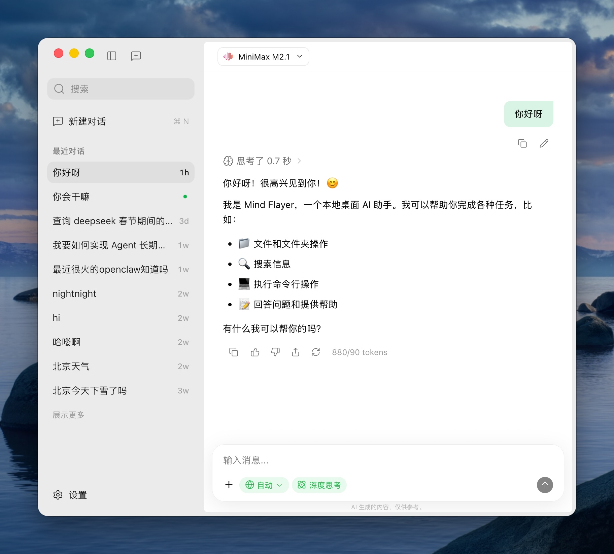

# 👻 Mind Flayer

<p align="center">
  
</p>

<p align="center">一个优雅简洁的桌面 AI 助手应用，基于 Tauri、React、Vercel AI SDK 等技术构建！</p>

<br>

<div align="center">
  <p>
    
    
    
    
    
    
    
    
    
    
    
    
  </p>
</div>

<p align="center">
  <a href="README.md">English</a> | 简体中文
</p>

<br>

## 截图

<p align="center">
  
</p>

<br>

## 开发

```sh
pnpm install          # 安装全部依赖
pnpm dev              # 启动开发环境（前端 + Tauri）
pnpm test             # 运行全部测试（vitest + cargo）
pnpm build            # 构建生产版本
```

<br>

## 技术栈

### 前端

- **[React 19](https://react.dev/)** - 用于构建用户界面的 JavaScript 库，支持最新的并发特性和优化
- **[TypeScript](https://www.typescriptlang.org/)** - 具有类型安全和更好开发体验的 JavaScript 超集
- **[Vite 7](https://vitejs.dev/)** - 下一代前端构建工具，拥有极速的开发服务器和优化的生产构建
- **[Tailwind CSS 4](https://tailwindcss.com/)** - 实用优先的 CSS 框架，用于快速构建现代 UI
- **[shadcn/ui](https://ui.shadcn.com/)** - 基于 Radix UI 和 Tailwind CSS 构建的精美设计组件库

### 后端

- **[Tauri 2.0](https://tauri.app/)** - 使用 Web 技术构建轻量、安全且跨平台的桌面应用
- **[Rust](https://www.rust-lang.org/)** - 高性能、内存安全的系统编程语言，为 Tauri 后端提供支持

### AI 集成

- **[AI SDK](https://ai-sdk.dev/)** - Vercel AI SDK，用于通过框架 hooks 和统一 API 构建 AI 驱动的流式文本和聊天应用

### 开发工具

- **[pnpm 10](https://pnpm.io/)** - 快速、节省磁盘空间的包管理器
- **[Biome](https://biomejs.dev/)** - 统一的格式化和 lint 工具，替代 Prettier 和 ESLint
- **[Vitest](https://vitest.dev/)** - Vite 原生单元测试框架，提供快速测试体验
- **[Lefthook](https://github.com/evilmartians/lefthook)** - 快速而强大的 Git hooks 管理器
- **[Commitlint](https://commitlint.js.org/)** - 根据约定标准检查 commit 信息
- **[Release-it](https://github.com/release-it/release-it)** - 自动化版本控制和包发布

<br>
